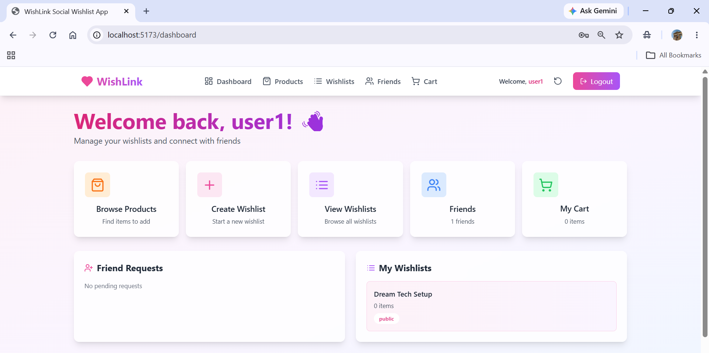
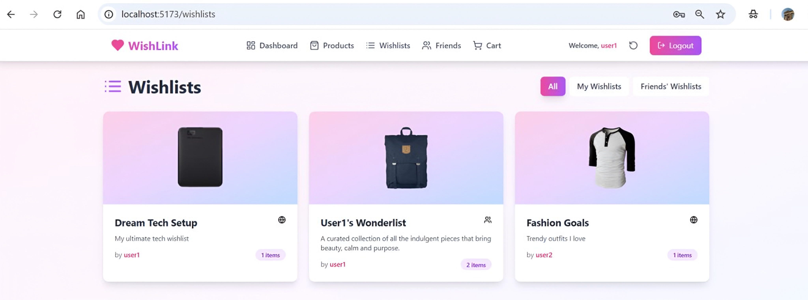

# WishLink

## Overview

WishLink is a modern wishlist management web application that allows users to create, organize, and manage wishlists easily. Users can add products, manage carts, connect with friends, and track wishlist activities through a clean and responsive interface.

---

## Features

- User Authentication
- Wishlist Creation & Management
- Add to Cart Functionality
- Checkout System
- Friends Integration
- Responsive UI
- Dashboard Overview
- Product Management
- Modern User Experience

---

## Tech Stack

### Frontend
- React
- TypeScript
- Vite
- Tailwind CSS

### Backend Services
- Supabase

### State Management & Routing
- React Context API
- React Router DOM

---

## Folder Structure

```bash
src/
├── components/
├── contexts/
├── pages/
├── utils/
├── App.tsx
└── main.tsx
```

---

## Installation

### Clone the repository

```bash
git clone https://github.com/harshithakanthamani/WishLink.git
```

### Navigate to the project directory

```bash
cd WishLink
```

### Install dependencies

```bash
npm install
```

### Start development server

```bash
npm run dev
```

---

## Environment Variables

Create a `.env` file in the root directory and add:

```env
VITE_SUPABASE_URL=your_supabase_url
VITE_SUPABASE_ANON_KEY=your_supabase_anon_key
```

---

## Screenshots

### Login Page


---

### Dashboard



---

### Products Page


---

### Friends Page


---

### WishLink Home



---

## Future Improvements

- Real-time notifications
- Payment gateway integration
- Product recommendations
- Dark mode support
- Mobile app version
- Social sharing features

---

## Live Demo

(Add your deployed link here)

Example:

```bash
https://wishlink.vercel.app
```

---

## Author

Harshitha Kanthamani

GitHub: https://github.com/harshithakanthamani

---

## License

This project is licensed under the MIT License.